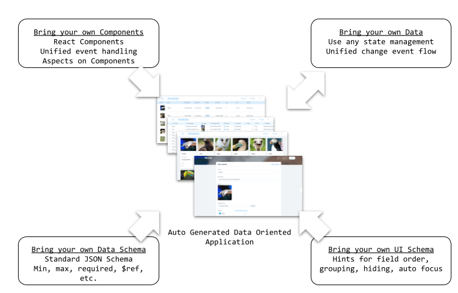

# AutoViews

`AutoViews` is a utility to render generic data forms given a
set of components and data schema.

- no coupling with any components
- based on standarts, like JSONSchema, JSONPatch and JSONPointer
- build with TypeScript

Additional Resources: [GitHub](https://github.com/wix-incubator/autoviews/),
[Get Started](/docs/)

## AutoViews showcase

## The Elements of AutoViews

‘AutoViews’ renders UI by combining 4 elements

1. **Your Components**

   AutoViews Repository serves as a map of data types to the components to be used when rendering data of that type. The library does not include the actual components, rather it allows injecting different React component libraries such as material UI or others.

   More about [the Components Repository](/docs/entities/components-repo)

2. **Your Data Schema**

   JSON Schema that describes your data.
   The schema provides nested structure, field types, titles and descriptions as well as constraints such as min, max, required.

   More about [the Data JSONSchema](/docs/entities/the-json-schema)

3. **Your Data**

   AutoViews interact with data using two properties - the `data` property and the `onChange` event, which provide a unified data and events model regardless of the nesting level, data type or control used.

   More about the [AutoView Data property](/docs/basic/autoview) and the [Events model](/docs/entities/events)

4. **Your UI Schema**

   The UI Schema adds another layer of hints that can be used by components to fine tune the rendered UI. UI Schema includes field ordering, grouping, component selection, field hiding and auto focus hints.

   More about [the UI Schema](/docs/entities/ui-schema)
